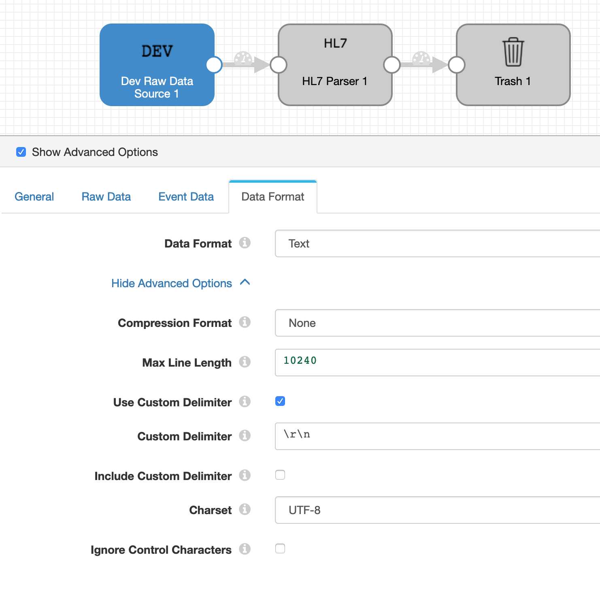
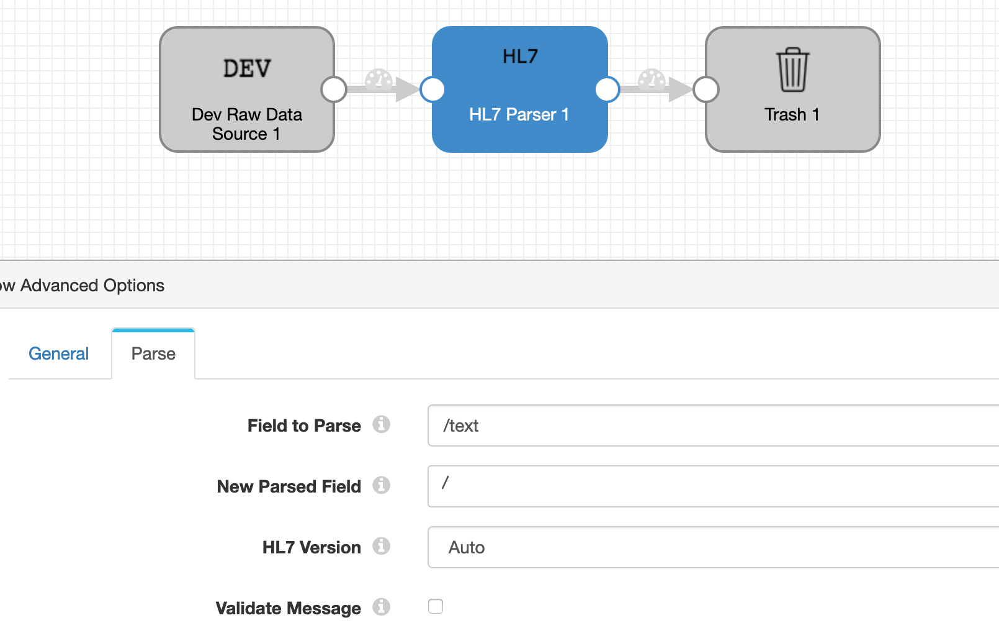
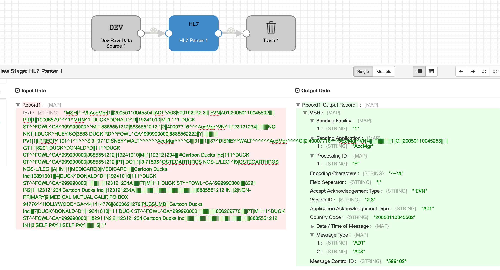

# hl7Parser
A simple hl7Parser processor that parses an hl7 version 2.x message into a StreamSets Data Collector Record.

# Pre-Requisites
#### Step 1: [Click Here](./target/hl7Parser-1.0-SNAPSHOT.tar.gz?raw=true) to download the parser and save to your drive.
#### Step 2: Extract the parser and install it into your Data Collector by following the instructions detailed here: [Custom Stage Library](https://streamsets.com/documentation/datacollector/latest/help/datacollector/UserGuide/Configuration/CustomStageLibraries.html?)
#### Step 3: Restart Data Collector.
#### Step 4: Create a pipeline where the source is reading HL7 messages (in text format).



#### Step 5: Add an HL7 parser processor to parse the text messages:



#### Step 6: Run a preview



## Note:
1. This parser only works with HL7 version 2.x
2. Each messages must be conformant and end with a carriage return as the segment terminator.

That's it!
Continue reading if you want to build the parser on your own.

## To build the parser with a different Data collector version

1. Download StreamSets Data Collector (SDC) or use an existing instance (SDC version 3.x and above).

2. Clone and build hl7Parser
```
git clone https://github.com/rushah/hl7Parser.git
```
3. Go into the hl7Parser idrectory
```
cd hl7Parser
```

4. Execute a maven clean install
```
mvn clean install
```

A build success message should appear
```
...
[INFO] ------------------------------------------------------------------------
[INFO] BUILD SUCCESS
[INFO] ------------------------------------------------------------------------
[INFO] Total time: 9.874 s
[INFO] Finished at: 2018-02-08T12:07:24-08:00
[INFO] Final Memory: 31M/418M
[INFO] ------------------------------------------------------------------------
```

5. Navigate to your installed Data Collector, $SDC_DIST/user_libs directory and extract the hl7Parser binaries into user_libs. Example:
```
cd /opt/streamsets-datacollector/user-libs
tar xf ~/hl7Parser/target/hl7Parser-1.0-SNAPSHOT.tar.gz
```

6. Navigate to $SDC_CONF folder (/etc/sdc or ${SDC_HOME}/etc) to update the sdc-security.policy file and provide permissions to user_libs. Add the following lines to the sdc-security.policy file
```
grant codebase "file://${sdc.dist.dir}/user-libs/-" {
  permission java.security.AllPermission;
};
```

7. Save the file and restart StreamSets Data Collector

## Caution
This is a beta version. Do test it out and feel free to provide any feedback.
